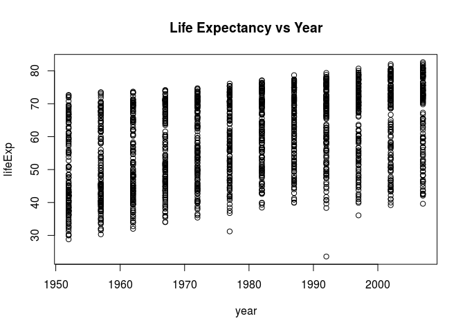
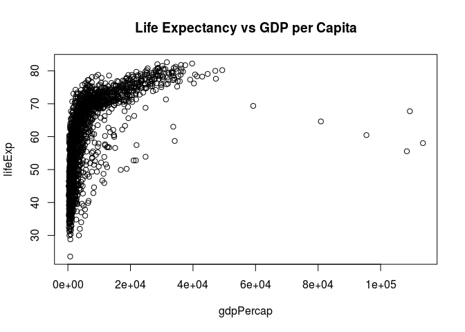
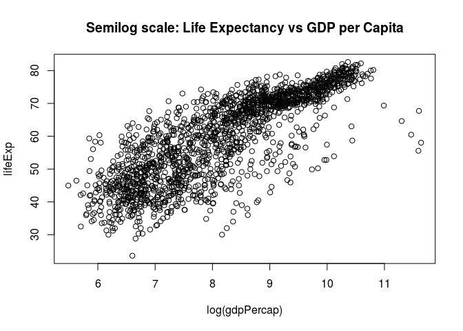

Homework 01
================
Adam Mattsson
2018-09-10

R Markdown for Gapminder exploration
====================================

Make an R Markdown document that explores a dataset, such as gapminder seen in class. You don’t need an extensive exploration in order to get a good grade here; a basic one will do, not unlike the one done in class, which would be considered sufficient (but less so the more verbatim your submission is). Render your R Markdown to the github\_document output format. Commit both the .Rmd and .md files and push them to GitHub.

First, lets load the packages/data necessary for exploratory analysis. The `gapminder` dataset is a massive UN database that compares the populations, gdp per capita, and life expectancy for most countries in 5 year incriments between 1952 and 2007.

``` r
library(gapminder)
```

Small test the data
-------------------

In this first section we will explore the dataset and its variables. It's always a good idea to innitially start with these type of basic exploratory anaysis to get a feel for the data, such as number of variables (and associated data types), observations and sample distribution etc.

``` r
typeof(gapminder)
```

    ## [1] "list"

``` r
ncol(gapminder)
```

    ## [1] 6

``` r
nrow(gapminder)
```

    ## [1] 1704

An easier way to get the same information is to make use of the `str()` argument, as such:

``` r
str(gapminder)
```

    ## Classes 'tbl_df', 'tbl' and 'data.frame':    1704 obs. of  6 variables:
    ##  $ country  : Factor w/ 142 levels "Afghanistan",..: 1 1 1 1 1 1 1 1 1 1 ...
    ##  $ continent: Factor w/ 5 levels "Africa","Americas",..: 3 3 3 3 3 3 3 3 3 3 ...
    ##  $ year     : int  1952 1957 1962 1967 1972 1977 1982 1987 1992 1997 ...
    ##  $ lifeExp  : num  28.8 30.3 32 34 36.1 ...
    ##  $ pop      : int  8425333 9240934 10267083 11537966 13079460 14880372 12881816 13867957 16317921 22227415 ...
    ##  $ gdpPercap: num  779 821 853 836 740 ...

It could also be useful to individualy inspect the different variables in the dataset. This might shed some light on the actual structure of the data and what the different levels of the variables are.

``` r
summary(gapminder$continent)
```

    ##   Africa Americas     Asia   Europe  Oceania 
    ##      624      300      396      360       24

``` r
summary(gapminder$year)
```

    ##    Min. 1st Qu.  Median    Mean 3rd Qu.    Max. 
    ##    1952    1966    1980    1980    1993    2007

``` r
summary(gapminder$lifeExp)
```

    ##    Min. 1st Qu.  Median    Mean 3rd Qu.    Max. 
    ##   23.60   48.20   60.71   59.47   70.85   82.60

``` r
summary(gapminder$gdpPercap)
```

    ##     Min.  1st Qu.   Median     Mean  3rd Qu.     Max. 
    ##    241.2   1202.1   3531.8   7215.3   9325.5 113523.1

Data visualization
------------------

``` r
plot(lifeExp ~ year, gapminder)
title(main = "Life Expectancy vs Year")
```



The UN recorded GDP per capita in the available data, and therefore we can look to see how strong the correlation between wealth and life expectancy really is.

``` r
plot(lifeExp ~ gdpPercap, gapminder)
title(main = "Life Expectancy vs GDP per Capita")
```



This data is difficult to interpret with the current axes, perhaps a log scale plot of GDP per capita will improve the visualization:

``` r
plot(lifeExp ~ log(gdpPercap), gapminder)
title(main = "Semilog scale: Life Expectancy vs GDP per Capita")
```


